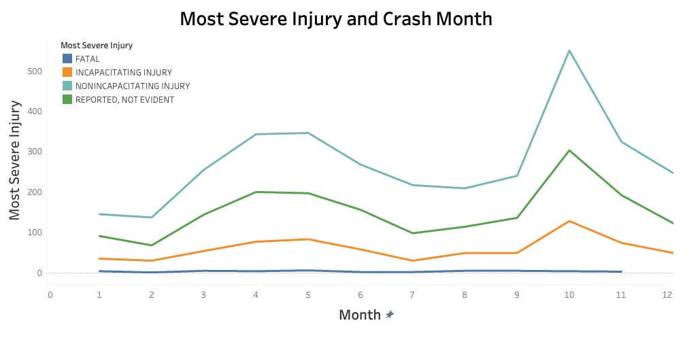
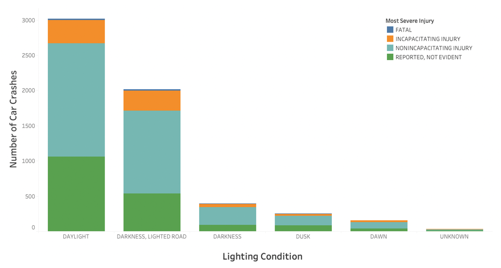

# Chicago Car Crashes During Rain

## Overview

This project aims to analyze the Chicago car crashes data to determine influencial factors on severity of injuries resulting them. Specifically, this project focuses on car crashes that occurred during rain. The ultimate goal of this project is to provide 3 actionable recommendations to first responders in Chicago for not only improving their response protocols but also reducing frequencies of the car crashes on a rainy day.

## Business Situation

Rain is a dangerous risk factor when driving. Slick road condition and hindered vision may cause car crashes that can lead to injuries, even fatality. As number of first responders including emergency medical technicians and paramedics decreases, Chicago needs optimization of first responders' personnel and protocols, especially during when danger risk factors for car crashes such as rain occur. Therefore, analyzing the car crashes occurred during rain in Chicago can provide valuable insights to potential optimization strategies for Chicago first responders.

## Data Information

The car crashes data for this project is from [Chicago Data Portal](https://data.cityofchicago.org/Transportation/Traffic-Crashes-Crashes/85ca-t3if). Please note that this dataset file is uploaded via **GitHub large file storage**.

## Methods

We apply some filters to focus on a subset of the dataset gathered for the purpose of this project. First, we decide to only retrieve data from car crashes that occurred during **rainy weather condition**. Also, the main categories of data we decide to focus on are the different **lighting condition**, **crash hour**, **crash day of week**, and **crash month**. It is important to note that the given dataset have some limitations, such as some degree of reporting discrepencies and subjectivity during data acquiring process.

We complete several exploratory data analyses including **injury severity by month** and **number of car crashes by lighting condition**.
 

Afterwards, we look at several models to investigate important factors when predicting injuries resulting from car crashes during rain. Here are the models we explore:

1. Baseline model (Dummy Classifer)

2. Binary Decision Tree

3. Binary Logistic Regression

4. Multinomial Decision Tree

5. Multinomial Logistic Regression (our final model)

We evaluate the **recall** of these models as we care about the false negative. We decide that our final model is the **multinomial logistic regression** model, because it offers not only important factors but also coefficients for interpretation. The binomial models have important factors for having injuries or no injuries from the car crashes. On the other than, the multinomial models look for the severity of resulting injuries and important determinants. We conclude that one of the most influencial factor for more several injuries such as fatal and incapacitating injuries is the **lighting condition**, especially dark roads with dim lighting when it is raining. More detailed information on model evaluations can be found in the [Jupyter notebook](./index.ipynb) and the appendix of our [presentation](./presentation.pdf).

## Conclusions

This project ultimately aims to provide recommendations to Chicago's first responders to consider when responding car crashes during rain.

- **Install safety measures** to poorly lit areas, and these measures can include traffic lights and runble strips.

- **Proactive weather monitoring** focusing on these areas.

- **Optimize personnel being dispatched** especially to these more crash-prone areas.

Please refer to the [Jupyter notebook](./index.ipynb) for additional EDAs and models, and the [presentation](./presentation.pdf) for the final run down of our findings.

If you have any questions, please contact our team:

Simon Hui (Technical Lead): [simonh9963@gmail.com](mailto:simonh9963@gmail.com)

Lillian Lakes (Presentation Lead): [lillian.lakes@gmail.com](mailto:lillian.lakes@gmail.com)

Sangyun (Yun) Thom (GitHub Lead): [sangyun.thom@gmail.com](mailto:sangyun.thom@gmail.com)

## Repository Structure

├── .gitignore

├── images

├── crashes.csv.zip

├── index.ipynb

├── notebook.pdf

├── presentation.pdf

├── README.md
